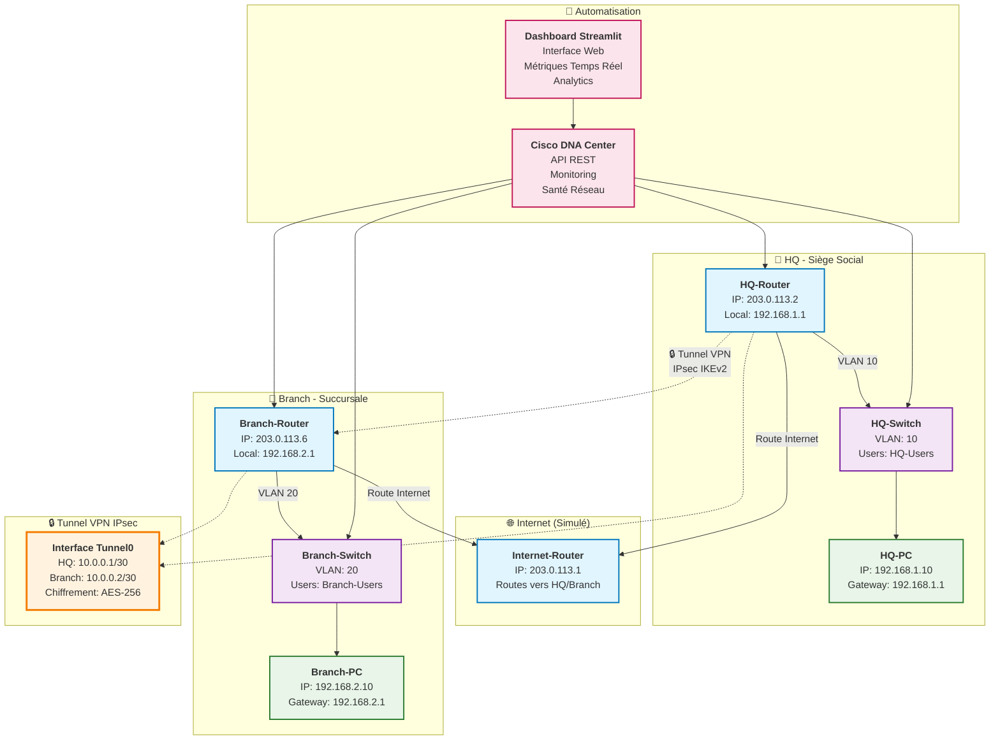
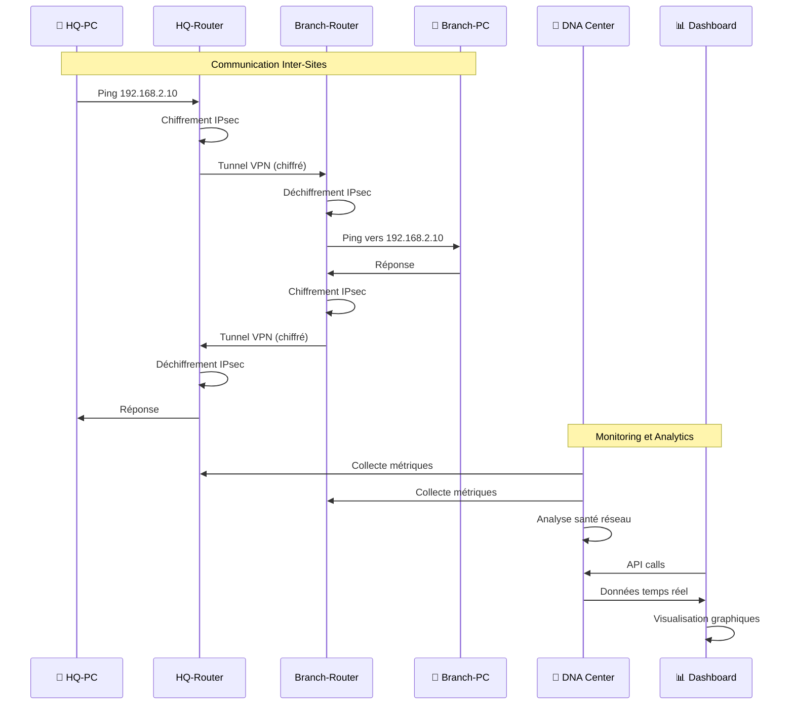
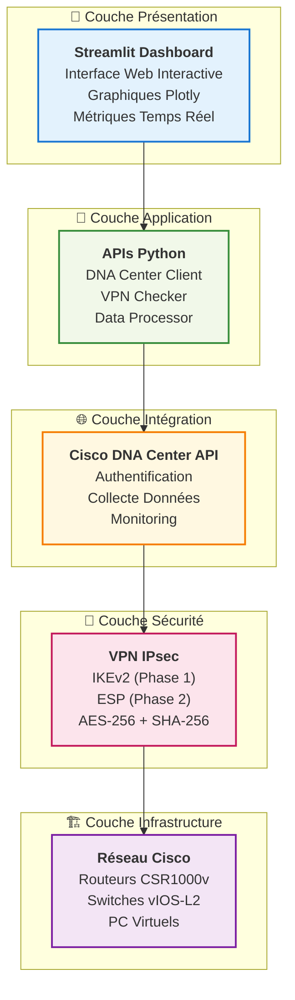
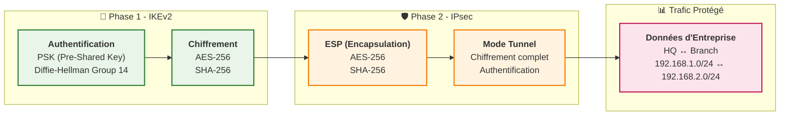

# 🏗️ Architecture du Projet VPN-DNAC

## Diagramme d'Architecture

## Flux de Données

## Technologies par Couche

## Composants du Système

| Composant | Rôle | Technologies |
|-----------|------|-------------|
| **🏢 HQ-Router** | Routeur principal du siège | Cisco CSR1000v, IKEv2, IPsec |
| **🏪 Branch-Router** | Routeur de la succursale | Cisco CSR1000v, IKEv2, IPsec |
| **🌐 Internet-Router** | Simulation d'Internet | Cisco CSR1000v, Routage statique |
| **🔌 Switches** | Gestion des VLANs locaux | Cisco vIOS-L2, VLANs |
| **💻 PC Virtuels** | Stations de travail | vPC, Configuration réseau |
| **🤖 DNA Center** | Automatisation et monitoring | API REST, Collecte métriques |
| **📊 Dashboard** | Interface utilisateur | Streamlit, Plotly, Pandas |

## Sécurité et Chiffrement

